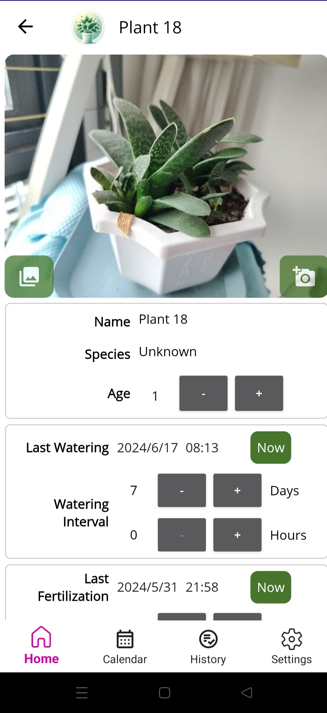
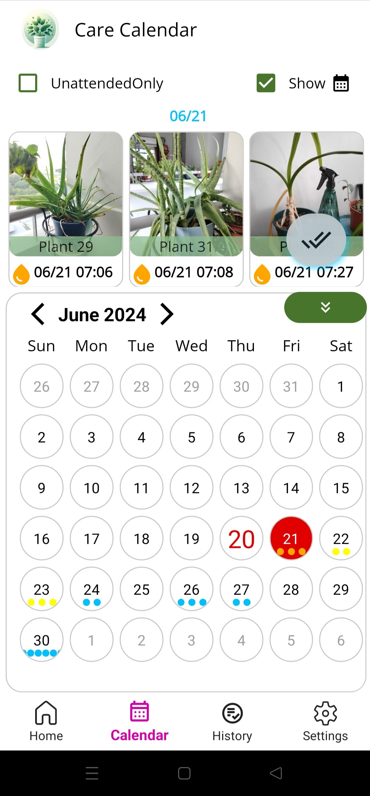
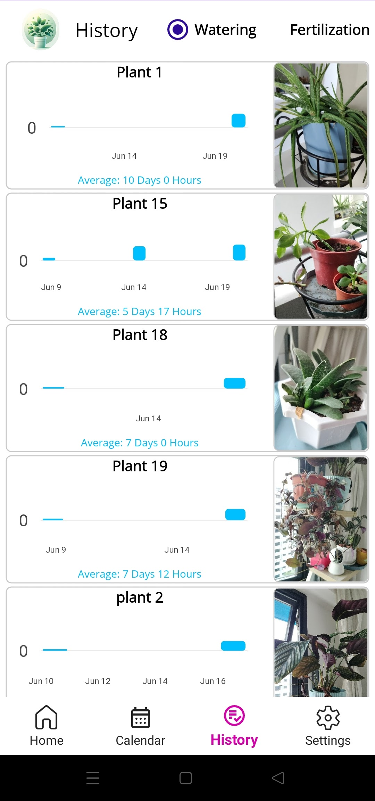

# PlantCare

PlantCare is a mobile application that helps users keep track of their plants and schedule reminders for watering and fertilizing.
It is developed base on .NET MAUI, and is currently only tested on Android devices.

## Features

- **Plant Management**: Users can add, edit, and delete plants. Each plant has a name, photo, and information about the last time it was watered and fertilized.
- **Reminders**: Users can set up reminders for watering and fertilizing their plants. Reminders can be scheduled for specific times and can be recurring.
- **Notifications**: Users receive notifications when it's time to water or fertilize their plants.

- All data is stored locally on the user's device.

## Some Screenshots

## Privacy Policy

<https://www.freeprivacypolicy.com/live/ce9df1df-a33e-4e29-a481-a9360608a147>
<https://www.freeprivacypolicy.com/free-privacy-policy-generator/>
