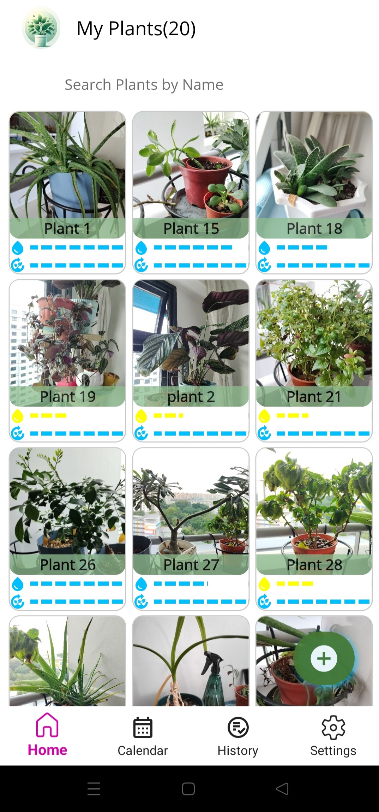

# PlantCare

PlantCare is a mobile application that helps users keep track of their plants and schedule reminders for watering and fertilizing.
It is developed based on .NET MAUI, and is currently only tested on Android devices.

## Features

- **Plant Management**: Users can add, edit, and delete plants. Each plant has a name, photo, and information about the last time it was watered and fertilized.
- **Reminders**: Users can set up reminders for watering and fertilizing their plants. Reminders can be scheduled for specific times and can be recurring.
- **Notifications**: Users receive notifications when it's time to water or fertilize their plants.
- **Care History**: Track complete watering and fertilization history for each plant with visual charts.
- **Calendar View**: View all upcoming care tasks in a calendar format.
- **Data Export/Import**: Backup and restore your plant data including photos.
- **Multi-language Support**: Available in English and Chinese (Simplified).
- All data is stored locally on the user's device.

## Technology Stack

- **Framework**: .NET MAUI (.NET 10)
- **UI Pattern**: MVVM with CommunityToolkit.Mvvm
- **Database**: SQLite with Entity Framework Core
- **Platforms**: Android, iOS, Windows (Android primarily tested)
- **Key Libraries**:
  - CommunityToolkit.Maui - UI controls
  - Plugin.LocalNotification - Local notifications
  - AutoMapper - Object mapping
  - Serilog - Logging
  - LiveChartsCore - Data visualization
  - XCalendar - Calendar UI

## Quick Start

### Prerequisites

- .NET 10 SDK
- Visual Studio 2022 (v17.11+) or Visual Studio Code
- .NET MAUI workload installed
- Android SDK (for Android development)
- Xcode (for iOS development, macOS only)

### Setup

1. **Clone the repository**
   ```bash
   git clone https://github.com/JianpingCAI/PlantCare.git
   cd PlantCare
   ```

2. **Restore packages**
   ```bash
   dotnet restore
   ```

3. **Build the solution**
   ```bash
   dotnet build
   ```

4. **Run the app**
   ```bash
   # Android
   dotnet build -t:Run -f net10.0-android
   
   # iOS (macOS only)
   dotnet build -t:Run -f net10.0-ios
   
   # Windows
   dotnet build -t:Run -f net10.0-windows10.0.26100.0
   ```

For detailed setup instructions, see [docs/SETUP_DEVELOPMENT.md](docs/SETUP_DEVELOPMENT.md).

## Project Structure

```
PlantCare/
├── PlantCare.App/              # Main MAUI application
│   ├── Views/                  # XAML pages
│   ├── ViewModels/             # ViewModels (MVVM)
│   ├── Services/               # Application services
│   ├── Models/                 # View models
│   └── Resources/              # Images, styles, localization
├── PlantCare.Data/             # Data access layer
│   ├── DbModels/               # Database entities
│   ├── Repositories/           # Data repositories
│   ├── Models/                 # Domain models
│   └── Migrations/             # EF Core migrations
├── PlantCare.App.Tests/        # Unit tests
├── docs/                       # Documentation
└── screenshots/                # App screenshots
```

## Architecture

PlantCare follows a clean architecture approach with:

- **MVVM Pattern**: Clear separation between UI and business logic
- **Repository Pattern**: Abstracted data access layer
- **Dependency Injection**: .NET's built-in DI container
- **Messaging**: Loosely-coupled communication using WeakReferenceMessenger
- **Service Layer**: Business logic encapsulated in services

For detailed architecture documentation, see [docs/ARCHITECTURE.md](docs/ARCHITECTURE.md).

## Database

PlantCare uses SQLite for local data storage with the following schema:

- **Plants** - Plant information and care schedules
- **WateringHistory** - Historical watering records
- **FertilizationHistory** - Historical fertilization records

All database operations are handled through Entity Framework Core with automatic migrations.

See [docs/DATABASE_SCHEMA.md](docs/DATABASE_SCHEMA.md) for complete schema documentation.

## Screenshots




## Documentation

Comprehensive documentation is available in the `docs/` folder:

- **[ARCHITECTURE.md](docs/ARCHITECTURE.md)** - Technical architecture and design patterns
- **[SETUP_DEVELOPMENT.md](docs/SETUP_DEVELOPMENT.md)** - Development environment setup guide
- **[API_DOCUMENTATION.md](docs/API_DOCUMENTATION.md)** - Internal API and service documentation
- **[DATABASE_SCHEMA.md](docs/DATABASE_SCHEMA.md)** - Database schema and migrations
- **[TESTING.md](docs/TESTING.md)** - Testing strategy and guide
- **[CHANGELOG.md](docs/CHANGELOG.md)** - Version history and changes

## Testing

Run the unit tests:

```bash
dotnet test
```

For more information about testing, see [docs/TESTING.md](docs/TESTING.md).

## Building for Release

### Android (APK/AAB)

```bash
dotnet publish -f net10.0-android -c Release
```

Output: `PlantCare.App/bin/Release/net10.0-android/publish/`

### iOS (IPA)

```bash
dotnet publish -f net10.0-ios -c Release
```

### Windows (MSIX)

```bash
dotnet publish -f net10.0-windows10.0.26100.0 -c Release
```

## Contributing

This is a personal development project, but suggestions and feedback are welcome!

1. Fork the repository
2. Create a feature branch (`git checkout -b feature/amazing-feature`)
3. Commit your changes (`git commit -m 'Add amazing feature'`)
4. Push to the branch (`git push origin feature/amazing-feature`)
5. Open a Pull Request

## Roadmap

- [ ] Complete iOS testing and optimization
- [ ] Complete Windows testing and optimization
- [ ] Plant identification using AI/ML
- [ ] Cloud synchronization (optional)
- [ ] Weather integration for smart watering suggestions
- [ ] Community features (share plant care tips)
- [ ] Plant disease detection

## License

This project is licensed under the MIT License - see the LICENSE file for details.

## Privacy Policy

<https://www.freeprivacypolicy.com/live/ce9df1df-a33e-4e29-a481-a9360608a147>

## Acknowledgments

- Built with [.NET MAUI](https://dotnet.microsoft.com/apps/maui)
- Icons from [Material Icons](https://fonts.google.com/icons)
- UI components from [CommunityToolkit.Maui](https://github.com/CommunityToolkit/Maui)

## Contact

**Jianping CAI**
- GitHub: [@JianpingCAI](https://github.com/JianpingCAI)
- Repository: [PlantCare](https://github.com/JianpingCAI/PlantCare)

---

**Happy Planting! 🌱**
